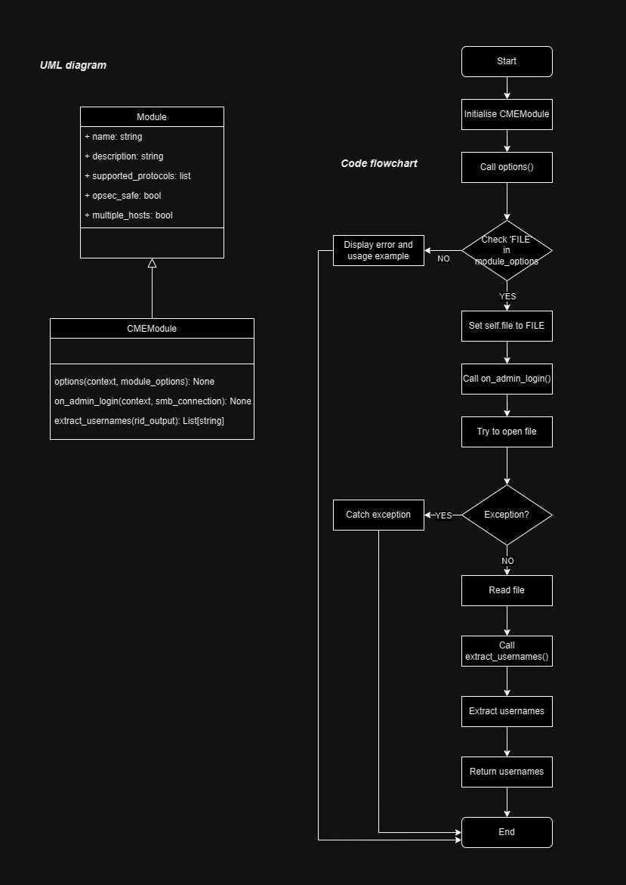

# Extract Usernames Module - Technical Documentation

This document provides a comprehensive technical overview of the `UserListFromRIDBrute` module for CrackMapExec (CME), detailing its structure, components, and usage.

## Overview
The `UserListFromRIDBrute` module is designed to process the output from CrackMapExec's `--rid-brute` flag, specifically extracting usernames where the `sidtype` is 'SidTypeUser'. This module is useful in cybersecurity contexts, particularly when analysing domain user accounts.

# Module Structure

```plaintext
extract_usernames/
│
└── UserListFromRIDBrute.py - Main module for extracting usernames from the `--rid-brute` output.
```

# Diagram
<p align="center">

</p>
## UserListFromRIDBrute.py

**Purpose:** Processes the `--rid-brute `output file to extract usernames where sidtype is 'SidTypeUser'.

**Key Methods:**

- `options(context, module_options)`: Handles input options, specifically the file path for the `--rid-brute` output.
- `on_admin_login(context, smb_connection)`: Triggered on an authenticated administrative session; handles file parsing and username extraction.
- `extract_usernames(rid_output)`: Extracts usernames from the provided RID brute output using a regular expression.

**Properties:**

- `name`: Identifies the module's name as 'extract_usernames'.
- `description`: Provides a brief description of the module's purpose.
- `supported_protocols`: Lists the protocols supported by the module, in this case, ['smb'].
- `opsec_safe`: Indicates that the module does not make any changes to the target.
- `multiple_hosts`: Denotes that the module can run on multiple hosts.

# Dependencies
- Python 3.x installed.
- CrackMapExec with support for custom modules.
- The `re` module for regular expression operations.
- The `cme.helpers.logger` module for logging and highlighting output.

## Setup and Configuration

**1. Module Installation:**
Place the `UserListFromRIDBrute.py` script into the CME custom modules directory.

**2. Running the Module:**
Execute the module by specifying the path to the `--rid-brute` output file:

```crackmapexec smb $TargetIP -u '' -p '' -M userListFromRIDBrute -o FILE=<rid_brute_output_file>```

# Usage
The `UserListFromRIDBrute` module is utilised by specifying it with the -M flag in CrackMapExec, along with the path to the `--rid-brute` output file.

# Error Handling
- File Read Errors: Managed within the `on_admin_login()` method.
- Regular Expression Match Errors: Handled in the `extract_usernames()` method.
- Input Validation Errors: Checked in the `options()` method.

# Testing
- Unit Testing: Individual methods can be tested using Python's unittest framework.
- Integration Testing: Testing the module in conjunction with CrackMapExec against a controlled environment.

# User documentation
[User documentation](USER-DOC.md)

# Contributing
Contributions should follow the established code structure and styling guidelines. Please ensure that all pull requests are accompanied by corresponding tests.